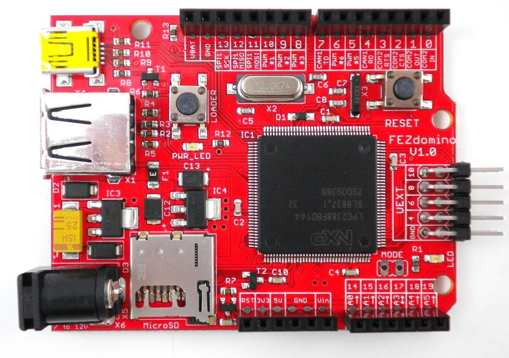

# FEZ-Domino-net-micro-framework
Open source board running Microsoft .NET Micro Framework. C#

This is a tiny open source board running Microsoft .NET Micro Framework. This allows you to more efficiently write code using Microsoft’s free Visual C# express and the C# programming language. Build your next projects in minutes by connecting FEZ Domino to one of the shields or the many available components. Many libraries are already included like FAT file system, threading, UART, SPI, I2C, GPIO, PWM, ADC, DAC and many more.

## .NET Micro Framework

The .NET Micro Framework (NETMF) is a .NET Framework platform for resource-constrained devices with at least 256 KB of flash and 64 KB of random-access memory (RAM). It includes a small version of the .NET Common Language Runtime (CLR) and supports development in C#, Visual Basic .NET, and debugging (in an emulator or on hardware) using Microsoft Visual Studio. NETMF features a subset of the .NET base class libraries (about 70 classes with about 420 methods), an implementation of Windows Communication Foundation (WCF), a GUI framework loosely based on Windows Presentation Foundation (WPF), and a Web Services stack based on Simple Object Access Protocol (SOAP) and Web Services Description Language (WSDL). NETMF also features added libraries specific to embedded applications. It is free and open-source software released under Apache License 2.0.

The Micro Framework aims to make embedded development easier, faster, and less costly by giving embedded developers access to the modern technologies and tools used by desktop application developers. Also, it allows desktop .NET developers to use their skills in embedded systems, enlarging the pool of qualified embedded developers.
